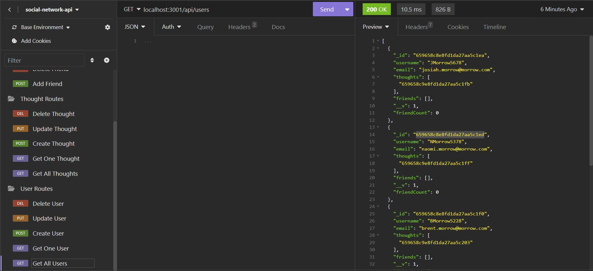

# Social Network API

## Description

My motivation for building this project was to gain experience with NoSQL and Mongoose.  I built this project so that I could practice creating my own API without using a SQL database.  I also wanted to practice building custom error messages for the API.  This project solves the problem of a web developer needing a social media API for his or her own website.  The intent would be for the developer to build a website and use this API, so that the developer doesn't need to create one himself (or herself).  In this project, I learned how to build the various routes for an API, and I also took on the optional task of adding custom error messages for various scenarios that the application may encounter, such as a developer providing a user ID that doesn't match any users in the database.

## Table of Contents (Optional)

- [Description](#description)
- [Note to Grader](#note-to-grader)
- [Installation](#installation)
- [Usage](#usage)
- [User Routes](#user-routes)
- [Thought Routes](#thought-routes)
- [Friend Routes](#friend-routes)
- [Reaction Routes](#reaction-routes)
- [Walkthrough Video Explanation](#walkthrough-video-explanation)
- [Credits](#credits)
- [License](#license)
- [Badges](#badges)
- [Features](#features)
- [How To Contribute](#how-to-contribute)
- [Tests](#tests)

## Note To Grader

Part of the assignment was to format the date of created thoughts and reactions using a 'getter', according to the assignment instructions.  I wasn't sure whether this meant I should use a virtual method or an instance method.  I spoke to the instructor, Matthew Miller, about it, and he said that there were comments, seemingly in the solution, that referred to the method that formatted the date as a virtual method.  Therefore, the consensus seems to be to use a virtual method to format the date.  Unfortunately, when using a virtual method, I can't make the name of the the formatted date be displayed as "createdAt".  This would conflict with the JSON property already named "createdAt" in the Thought model, and therefore throw an error.

## Installation

To start, clone my GitHub repository with the "git clone" command. In order to use this project as it currently stands, you will need to install both Insomnia and MongoDB. Insomnia can be downloaded here: [https://insomnia.rest/download](https://insomnia.rest/download). MongoDB installation instructions can be found here: [https://www.mongodb.com/docs/manual/tutorial/install-mongodb-on-windows/](https://www.mongodb.com/docs/manual/tutorial/install-mongodb-on-windows/).  Additionally, once you have cloned my repository and navigated to its directiory, you will need to install the necessary dependencies with the "npm install" command. Finally, you will need to create a .env file in the root project directory and add the following line of code to it:

DB_CONNECTION_STRING='mongodb://127.0.0.1:27017/social-network-api-database'

## Usage

Once you have followed the installation instructions above and navigated to the project's directory in Git Bash, run the command "mongod" and press **Enter**.  Next, open a different instance of Git Bash, navigate to the project's directory, and run the commands "npm run seed" to seed the Mongo database, and "npm start" to start the server.  If the server starts successfully, you will get a message saying that API server is listening on port 3001.

From here, open Insomnia and start creating routes. Here is a demonstration screenshot on running the GET localhost:3001/api/users route:

I will assume you know how to create new routes in Insomnia, and will therefore merely tell you which routes to create.  Please bear in mind that if a route contains a colon directly after a forward slash, such as like this: **localhost:3001/api/users/:id**, that means you will need to pass the parameter after the colon into the route when creating it in Insomnia.  For instance, with the above example route, here is an example of how you would pass in the ID: **localhost:3001/api/users/659482805e62643f36f6ceee**.   Here is a list of the routes you should create in Insomnia:

### User Routes

**1**. &nbsp;&nbsp;GET: &nbsp;&nbsp;localhost:3001/api/users

Successful Return:  &nbsp;All users

**2**. &nbsp;&nbsp;GET: &nbsp;&nbsp;localhost:3001/api/users/:id

Successful Return: &nbsp;The user that has the ID that matches the passed in :id parameter

**3**. &nbsp;&nbsp;POST: &nbsp;&nbsp;localhost:3001/api/users

JSON Body: &nbsp;{"username": "theboss1485","email": "theboss1485@gmail.com"}

This route creates a new user with a username of "theboss1485", and an email address of "theboss1485@gmail.com".

Successful Return: &nbsp;A message indicating that the user creation was successful, along with a JSON representation of the new user

**4**. &nbsp;&nbsp;PUT: &nbsp;&nbsp;localhost:3001/api/users/:id

JSON Body: &nbsp;{"username": "GMow","email": "theboss1486@gmail.com"}

This route updates the user with the passed-in user ID to have a username of "GMow", and an email address of "theboss1486@gmail.com".  This route also updates any thoughts that have the user's old username.  Those thoughts are then given the new, passed-in username.

Successful Return: &nbsp;A message indicating that the update of the user, and also the update of the user's thoughts (if applicable) was successful, along with a JSON representation of the updated user and any updated thoughts

**5**. &nbsp;&nbsp;DELETE: &nbsp;&nbsp;localhost:3001/api/users/:id

This route deletes the user with the passed-in ID, and it also deletes any thoughts the user had created.

Successful Return: &nbsp;A message indicating that the deletion of the user, and also the deletion of the user's thoughts, if they existed, was successful, along with a JSON representation of the deleted user and any deleted thoughts

### Thought Routes

**1**. &nbsp;&nbsp;GET: &nbsp;&nbsp;localhost:3001/api/thoughts

Successful Return: &nbsp;All thoughts

**2**. &nbsp;&nbsp;GET: &nbsp;&nbsp;localhost:3001/api/thoughts/:id

Successful Return: &nbsp;The thought that has the ID that matches the passed in :id parameter

**3**. &nbsp;&nbsp;POST: &nbsp;&nbsp;localhost:3001/api/thoughts

JSON Body: &nbsp;{"thoughtText": "I am here!","username": "JMorrow5678"}

This route creates a new thought with the thought text "I am here!".  This thought is then tied to the username "JMorrow5678"

Successful Return: &nbsp;A message indicating that the thought creation was successful, along with a JSON representation of the new thought, and also a JSON representation, of the updated user who created the thought, since the created thought has now been added to his or her list of thoughts.

**4**. &nbsp;&nbsp;PUT: &nbsp;&nbsp;localhost:3001/api/thoughts/:id

JSON Body: &nbsp;{"thoughtText": "I like this post."}

This route updates the thought with the passed-in ID to have the thought text "I like this post." 

Successful Return: &nbsp;A message indicating that the update of the thought was successful, along with the updated thought

**5**. &nbsp;&nbsp;DELETE: &nbsp;&nbsp;localhost:3001/api/thought/:id

This route deletes the thought with the passed-in ID.

Successful Return: &nbsp;A message indicating that the deletion of the thought was successful, along with the deleted thought

### Friend Routes

**1**. &nbsp;&nbsp;POST: &nbsp;&nbsp;localhost:3001/api/users/:userId/friends/:friendId

This route adds the user who has a user ID matching the passed-in friend ID to the friends array of the user with the passed-in user ID.

Successful Return: &nbsp;A message that the friend was added successfully, along with the user that matches the passed-in user ID, who now contains the passed-in friend ID in his/her friends array

**2**. &nbsp;&nbsp;DELETE: &nbsp;&nbsp;localhost:3001/api/users/:userId/friends/:friendId

This route removes the user with a user ID matching the passed-in friend ID from the friends array of the user with the passed-in user ID.

Successful Return: &nbsp;A message that the friend was deleted successfully, along with the user matching the passed-in user ID, who no longer contains the passed-in friend ID in his/her friends array

### Reaction Routes

**1**. &nbsp;&nbsp;POST: &nbsp;&nbsp;/api/thoughts/:thoughtId/reactions

JSON Body: &nbsp;{"reactionBody": "This is great!!"}

This route adds a new reaction to the thought with the passed-in thought ID.  This new reaction has the text "This is great!!".

Successful Return: &nbsp;A message that the reaction was created successfully, along with the thought matching the passed-in thought ID, whcih now contains the new reaction in its reactions array.

**2**. &nbsp;&nbsp;DELETE: &nbsp;&nbsp;/api/thoughts/:thoughtId/reactions/:reactionId

This route removes the reaction with the passed-in reaction ID from the reactions array of the thought with the passed-in thought ID.

Successful Return: &nbsp;A message that the reaction was deleted successfully, along with the thought that matches the passed-in thought ID, whcih no longer contains the deleted reaction in its reactions array

## Walkthrough Video Explanation

To view the walkthrough video for this application, please use the following link: [https://drive.google.com/file/d/1CKhCjM4e51BUJnBqn_KeYK1Hhu13htJC/view](https://drive.google.com/file/d/1CKhCjM4e51BUJnBqn_KeYK1Hhu13htJC/view).  The walkthrough video does appear to jump around in places, due to the fact that I edited it.  I edited the video to make it more cohesive and to allow it to fit within the two-minute time limit in the [video submission guide](https://coding-boot-camp.github.io/full-stack/computer-literacy/video-submission-guide).  If you are having trouble understanding what is going on in the walkthrough video, please pause the video and refer to this section of the README.

To start things off, I type the command "mongod" into Git Bash.  This starts up Mongo DB.  Next, I type the command "npm run seed" into Git Bash.  This seeds the database.  On the screen, messages appear that the users and thoughts have been seeded, thereby signifying that the seeding process is succussful.  Next, I type the command "npm start" into Git Bash.  This starts the server and a message appears that says the server is listening.  Next, I switch over to Insomnia.

In Insomnia, first I test the user routes.  I start off by running the GET localhost:3001/api/users route, which returns all of the users in the database.  The expected data is returned, indicating that the route is working correctly.  Next, I test the GET localhost:3001/api/users/:id route, which returns the user that matches the passed-in ID.  The expected user is returned, which verifies that this route is working correctly.  Next, I run the POST localhost:3001/api/users route, which creates a new user.  I pass in a JSON body of {"username": "theboss1485","email": "theboss1485@gmail.com"}, which creates a user with the username "theboss1485" and the email "theboss1485@gmail.com".  The system returns the created user, along with a message that the user was created, thereby signifying that the user was created successfully.  To be certain of this, I put the ID of the newly created user into the GET localhost:3001/api/users/:id route and run it again.  The system returns the newly created user.  Next I test the PUT localhost:3001/api/users/:id route, which updates the user that matches the passed-in ID.  I pass in a JSON body of {"username": "GMow","email": "theboss1485@gmail.com"}, which will update the username of the matching user to "GMow" and the email to "theboss1485@gmail.com".  The system returns a message indicating that the user was updated successfully.  The system also returns the updated user, which has the username "GMow" and the email "theboss1485@gmail.com". To make certain this put route is functioning correctly, I put the ID of the newly updated user into the GET localhost:3001/api/users/:id route and run it again.  The system returns the updated user, which has the expected updated data. Finally, I test the DELETE localhost:3001/api/users/:id route, which deletes the user corresponding to the passed-in ID.  I pass in the ID of one of the users.  The system responds with a message saying that the user and its associated thoughts were deleted successfully.  The system also passes back the deleted user and the user's deleted thought.  To make certain the delete route is working correctly, I run the GET localhost:3001/api/users route again.  The deleted user who had the username of "GMorrow1234" isn't in the list of users, thereby indicating that the DELETE route is working correctly.

Next, I test the thought routes.  First, I test the GET localhost:3001/api/thoughts route, which returns all of the thoughts.  The expected data is returned, thereby indicating that the route is working correctly.  It's also worth noting that this route doesn't return the deleted thought which belonged to the user I deleted previously.  This is one more confirmation that the "Delete User" route is working correctly.  Next, I test the GET localhost:3001/api/thoughts/:id route, which returns the thought that matches the passed-in ID.  The expected thought is returned, which verifies that this route is working correctly. Next, I run the POST localhost:3001/api/thoughts route, which creates a new thought.  I pass in a JSON body of {"thoughtText": "I am here!","username": "JMorrow5678"}, which creates a thought with the text "I am here", belonging to the user "JMorrow5678".  The system returns a message saying that the thought was successfully created.  Additionally, it returns the user that the thought belongs to.  That user now has the newly-created thought in his thoughts array.  I then run the GET localhost:3001/api/thoughts/:id route again, this time with the ID of the newly-created thought.  The new thought is returned, indicating that this POST route is working correctly.  Next I test the PUT localhost:3001/api/thoughts/:id route, which updates the thought that matches the passed-in ID.  I pass in a JSON body of {"thoughtText": "I like this post."}, which will update the text of the matching thought to "I like this post."  The system returns a message indicating that the thought was updated successfully.  It also returns the updated thought.  To make sure that this put route is functioning correctly, I put the ID of the newly updated thought into the GET localhost:3001/api/thought/:id route and run it again.  The system returns the updated thought, which has the expected updated text.  Finally, I test the DELETE localhost:3001/api/thoughts/:id route, which deletes the thought corresponding to the passed-in ID.  I pass in the ID of the newly-created thought.  The system responds with a message saying that the thought was deleted successfully.  Additionally, it passes back the deleted thought. To make certain the delete route is working correctly, I run the GET localhost:3001/api/thoughts route again.  The newly-deleted thought isn't in the returned list of thoughts, thereby indicating that this delete route is working correctly.

After that, I test the friend routes.  First, I test the POST localhost:3001/api/users/:userId/friends/:friendId route, which looks up the user corresponding to the passed-in friend ID.  It then adds that user to friends list of the user that corresponds to the passed-in user ID.  I make a request to add a friend to the user JMorrow5678's friends list.  The system sends back a message saying that the friend was added successfully.  The system also passes back the user with the new friend included in his friends list.  To make sure that this POST route is functioning correctly, I run the GET localhost:3001/api/users/:id route, and pass in the ID of the user JMorrow5678.  The system responds with the expected user, and this user now has the correct friend on his friends list, indicating that the POST route for adding friends is functioning correctly.  Next, I test the DELETE localhost:3001/api/users/:userId/friends/:friendId route, which looks up the user corresponding to the passed-in friend ID.  The route then deletes this user from the friends list of the user that corresponds to the passed-in user ID.  I make a request to delete the friend on the the user JMorrow5678's friends list.  The system passes back a message that the deletion of the friend is successful. It also passes back the user JMorrow5678.  His friends list is now empty, as it should be.  To make certain that the DELETE route is working correctly, I I run the GET localhost:3001/api/users/:id route, and pass in the ID of the user JMorrow5678.  This system passes back this user, and his friends list is empty, once again as it should be.  This indicates that the route to delete friends is working correctly.

Finally, I test the reaction routes.  First, I test the POST localhost:3001/api/thoughts/:thoughtId/reactions route.  I pass in a JSON body of {"reactionBody": "This is great!!"} which adds a reaction with the text of "This is great!!" to the thought that corresponds to the passed-in thought ID.  The system responds with a message saying that the reaction creation was successful.  It also passes back the thought with the newly-created reaction inside.  To make sure this route is working correctly, I run the GET localhost:3001/api/thoughts/:id route and pass in the ID of the thought I just added a reaction to.  The system returns the thought and the expected reaction is inside, indicating that the route for creating reactions is working correctly.  At last, I test the DELETE localhost:3001/api/thoughts/:thoughtId/reactions/:reactionId route, which looks up the thought corresponding to the passed-in thought ID.  It then deletes the reaction corresponding to the passed-in reaction ID from that thought.  I submit a query to delete the reaction I created previously.  The system responds with a message saying the reaction deletion was successful.  It also passes back the thought that corresponds to the passed-in thought ID, and the thought no longer has the reaction inside.  To make sure the DELETE route is working correctly, I run the GET localhost:3001/api/thoughts/:id route and pass in the ID of the thought I just deleted the reaction from.  The system reponds with this thought, but the reaction is now gone and is no longer associated with the thought, indicating that the route to delete reactions is working correctly.

## Credits

I used the Xpert Learning Assistant AI chatbot to help out with writing some of the code.  I also took a certain check in my index.js seed file from the Module 18 activities.

## License

This project is under an MIT License.  Please see the license in the GitHub repository for more information.

## Badges

I don't have any noteworthy badges to display

## Features

The project is a social networking API that allows users to create, read, update, and delete users and their thoughts.  It also allows users to add and delete friends to and from each other's friend lists.  Finally, this API allows users to create and delete reactions to thoughts that have been posted by various users.

## How to Contribute

This was an assignment I personally completed, so N/A

## Tests

N/A

